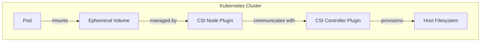
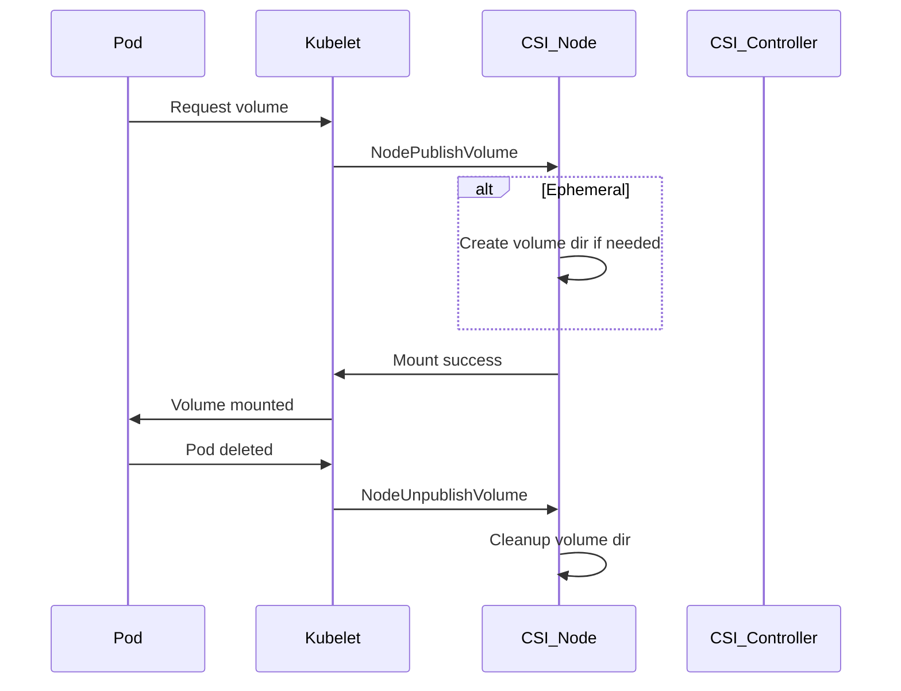

# Building a Kubernetes Ephemeral CSI Driver: Architecture, Code, and Real-World Usage

## Introduction

Kubernetes has revolutionized container orchestration, but storage remains a complex topic—especially for workloads that need temporary, fast, and disposable storage. In this blog, I'll walk you through building a **Kubernetes Ephemeral CSI Driver** from scratch, explain the architecture, show how CSI works, and provide code snippets and diagrams. By the end, you'll know how to use, test, and even extend this project in your own clusters.

---

## Table of Contents

1. [What is CSI and Why Ephemeral Volumes?](#what-is-csi-and-why-ephemeral-volumes)
2. [Project Architecture](#project-architecture)
3. [How CSI Works in Kubernetes](#how-csi-works-in-kubernetes)
4. [Code Walkthrough](#code-walkthrough)
5. [Deploying and Testing the Driver](#deploying-and-testing-the-driver)
6. [Consuming the Driver in Your Projects](#consuming-the-driver-in-your-projects)
7. [Contributing and Next Steps](#contributing-and-next-steps)
8. [References](#references)

---

## What is CSI and Why Ephemeral Volumes?

**CSI (Container Storage Interface)** is a standard for exposing arbitrary block and file storage systems to containerized workloads on Kubernetes and other orchestration systems.

**Ephemeral volumes** are temporary storage volumes that exist only for the lifetime of a pod. They're perfect for scratch space, caches, or any data that doesn't need to persist after the pod is gone.

---

## Project Architecture




- **CSI Controller**: Handles volume provisioning and deletion.
- **CSI Node**: Mounts/unmounts volumes on the node.
- **Ephemeral Volume**: Created on the node when the pod is scheduled, deleted when the pod is removed.

---

## How CSI Works in Kubernetes




1. **Pod requests a volume** via a `csi` volume source.
2. **Kubelet** calls the CSI Node plugin to create and mount the volume.
3. **Ephemeral logic**: The Node plugin creates the volume directory if it doesn't exist.
4. **Pod uses the volume** as local storage.
5. **Pod deletion** triggers the Node plugin to unmount and clean up the volume.

---

## Code Walkthrough

### CSI Driver Implementation

The core logic is in [`pkg/driver/driver.go`](https://github.com/chinnareddy578/kubernetes-ephemeral-csi/blob/main/pkg/driver/driver.go):

```go
func (d *Driver) NodePublishVolume(ctx context.Context, req *csi.NodePublishVolumeRequest) (*csi.NodePublishVolumeResponse, error) {
    // Create the volume directory if it doesn't exist (ephemeral support)
    volumePath := filepath.Join(d.basePath, req.VolumeId)
    if _, err := os.Stat(volumePath); os.IsNotExist(err) {
        if err := os.MkdirAll(volumePath, 0755); err != nil {
            return nil, status.Errorf(codes.Internal, "failed to create volume directory: %v", err)
        }
    }
    // Mount using bind mount
    cmd := exec.Command("mount", "--bind", volumePath, req.TargetPath)
    if err := cmd.Run(); err != nil {
        return nil, status.Errorf(codes.Internal, "failed to mount volume: %v", err)
    }
    return &csi.NodePublishVolumeResponse{}, nil
}
```

### Deployment YAML

The driver is deployed as a DaemonSet and Deployment. See [`deploy/kubernetes/csi-driver.yaml`](https://github.com/chinnareddy578/kubernetes-ephemeral-csi/blob/main/deploy/kubernetes/csi-driver.yaml):

```yaml
apiVersion: storage.k8s.io/v1
kind: CSIDriver
metadata:
  name: ephemeral.csi.local
spec:
  attachRequired: false
  podInfoOnMount: true
  volumeLifecycleModes:
    - Ephemeral
---
apiVersion: apps/v1
kind: DaemonSet
metadata:
  name: ephemeral-csi-node
  namespace: kube-system
spec:
  ...
```

---

## Deploying and Testing the Driver

### 1. Build and Load the Image

```bash
make build
docker build -t ephemeral-csi:latest .
minikube image load ephemeral-csi:latest
```

### 2. Deploy the Driver

```bash
kubectl apply -f deploy/kubernetes/csi-driver.yaml
```

### 3. Deploy a Test Pod


[`deploy/kubernetes/test-pod.yaml`](https://github.com/chinnareddy578/kubernetes-ephemeral-csi/blob/main/deploy/kubernetes/test-pod.yaml):

```yaml
apiVersion: v1
kind: Pod
metadata:
  name: test-ephemeral-volume
spec:
  containers:
  - name: test-container
    image: busybox
    command: ["/bin/sh", "-c", "while true; do echo 'Hello from ephemeral volume' >> /data/test.txt; sleep 5; done"]
    volumeMounts:
    - name: ephemeral-volume
      mountPath: /data
  volumes:
  - name: ephemeral-volume
    csi:
      driver: ephemeral.csi.local
      volumeAttributes:
        size: "1Gi"
```

### 4. Validate the Volume


```bash
kubectl exec test-ephemeral-volume -- cat /data/test.txt
```

You should see repeated log entries.

### 5. Validate Cleanup


Delete the pod and check that the volume directory is removed from the node.

---

## Consuming the Driver in Your Projects

- Reference the CSI driver in your pod specs as shown above.
- Use the `csi` volume type with `ephemeral.csi.local` as the driver.
- Adjust `volumeAttributes` as needed for your use case.

---

## Contributing and Next Steps

- **Issues**: Use the [GitHub issue tracker](https://github.com/chinnareddy578/kubernetes-ephemeral-csi/issues).
- **Pull Requests**: Fork the repo, create a feature branch, and submit a PR.
- **Ideas**: Add support for more volume types, metrics, or advanced cleanup logic.

---

## References

- [Kubernetes CSI Documentation](https://kubernetes.io/docs/concepts/storage/volumes/#csi)
- [CSI Spec](https://github.com/container-storage-interface/spec)
- [Project GitHub Repo](https://github.com/chinnareddy578/kubernetes-ephemeral-csi)

---

## Final Thoughts

Building a CSI driver is a great way to learn about Kubernetes internals and storage. Ephemeral volumes are a powerful tool for stateless workloads, CI/CD pipelines, and more. Try out the project, contribute, and let's make Kubernetes storage even better!

---

**Want more deep dives like this? Follow me on [LinkedIn/Twitter/YourPlatform] and star the [GitHub repo](https://github.com/chinnareddy578/kubernetes-ephemeral-csi)!** 